# PoeMCP — Examples

- [Setup](#setup)
  - [Claude Desktop](#claude-desktop)
  - [Claude Code (CLI)](#claude-code-cli)
- [Examples](#examples)
  - [Following a streamer's build plan](#following-a-streamers-build-plan)
  - [Researching gear for your build](#researching-gear-for-your-build)
  - [Looking up what mods can roll on an item](#looking-up-what-mods-can-roll-on-an-item)
  - [Understanding a gem or support mechanic](#understanding-a-gem-or-support-mechanic)
  - [Understanding a keystone or passive](#understanding-a-keystone-or-passive)
  - [Checking live prices](#checking-live-prices)
  - [Looking up a map](#looking-up-a-map)

---

## Setup

### Claude Desktop

1. Clone the repo and install:

```bash
git clone https://github.com/shalayiding/POEMCP.git
cd PoeMCP
pip install -e .
```

2. Open your Claude Desktop config file:
   - **macOS:** `~/Library/Application Support/Claude/claude_desktop_config.json`
   - **Windows:** `%APPDATA%\Claude\claude_desktop_config.json`

3. If you having problem finding the config file from path:

- go to setting in Claude 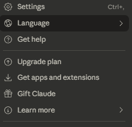
- click developer option 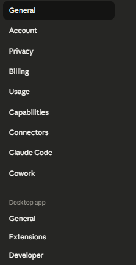
- click Edit Config 

4. Add the following block (replace the path with where you cloned the repo):

**macOS / Linux:**

```json
{
  "mcpServers": {
    "poemcp": {
      "command": "python",
      "args": ["/path/to/PoeMCP/server.py"]
    }
  }
}
```

**Windows:**

```json
{
  "mcpServers": {
    "poemcp": {
      "command": "python",
      "args": ["C:\\path\\to\\PoeMCP\\server.py"]
    }
  }
}
```

4. Restart Claude Desktop. You should see the PoeMCP tools available in the tool panel.

---

### Claude Code (CLI)

Add to your project's `.mcp.json`:

```json
{
  "mcpServers": {
    "poemcp": {
      "command": "python",
      "args": ["/path/to/PoeMCP/server.py"]
    }
  }
}
```

---

## Examples

### Following a streamer's build plan

Paste any pobb.in link and ask Claude to walk you through the progression. Claude reads every gear stage, skill swap, and note the build author wrote — so instead of opening PoB and navigating between 10 loadouts yourself, you just ask where you are in the guide.

**Prompt:**

> I'm level 45 following this build: https://pobb.in/1XSuSM9GWyJv — what should my gear and skill links look like right now?

<!-- screenshot: claude responding with stage 3 gear and skill links from the RF guide -->

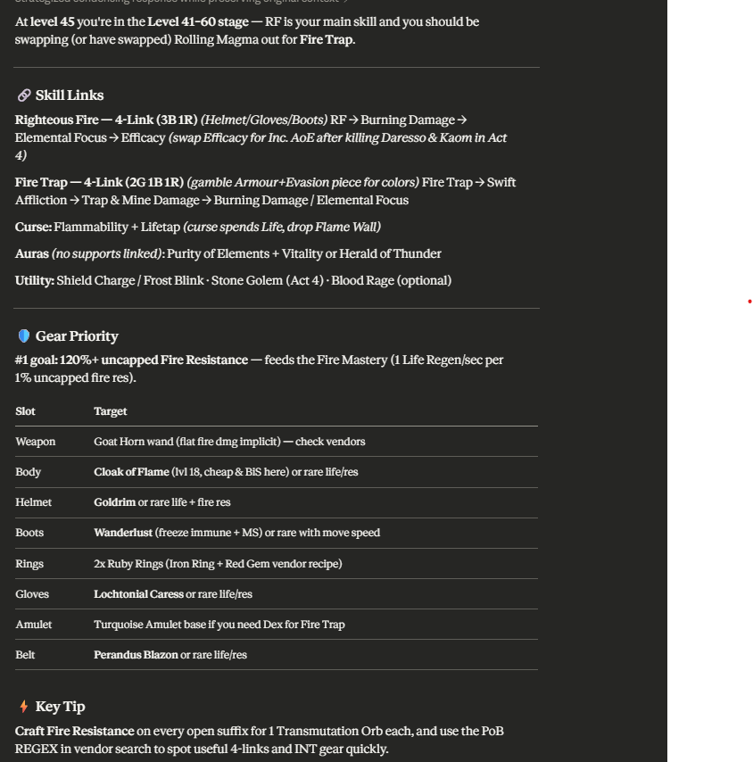

**Prompt:**

> I'm following this build: https://pobb.in/1XSuSM9GWyJv, and here my pob link why I have no damage  and dying a lot can you guide me for next upgrade here is my build please !!! https://pobb.in/iXUUINR7kPRO

<!-- screenshot: claude quoting the relevant section from the build notes -->

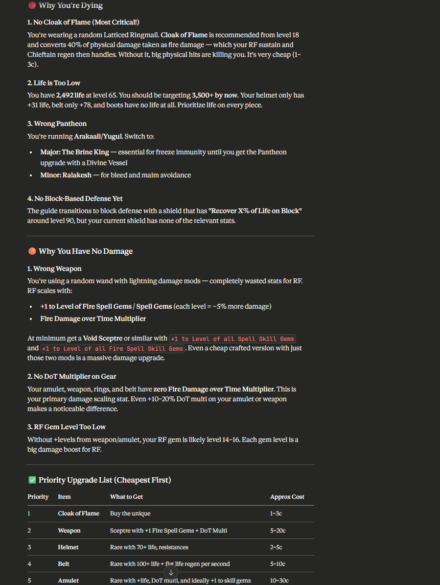

---

### Researching gear for your build

Ask about any unique item to get its full mod list, how to acquire it, and what div cards drop it.

**Prompt:**

> What does Mageblood do and how do I get one?

<!-- screenshot: claude showing mageblood mods + acquisition methods -->

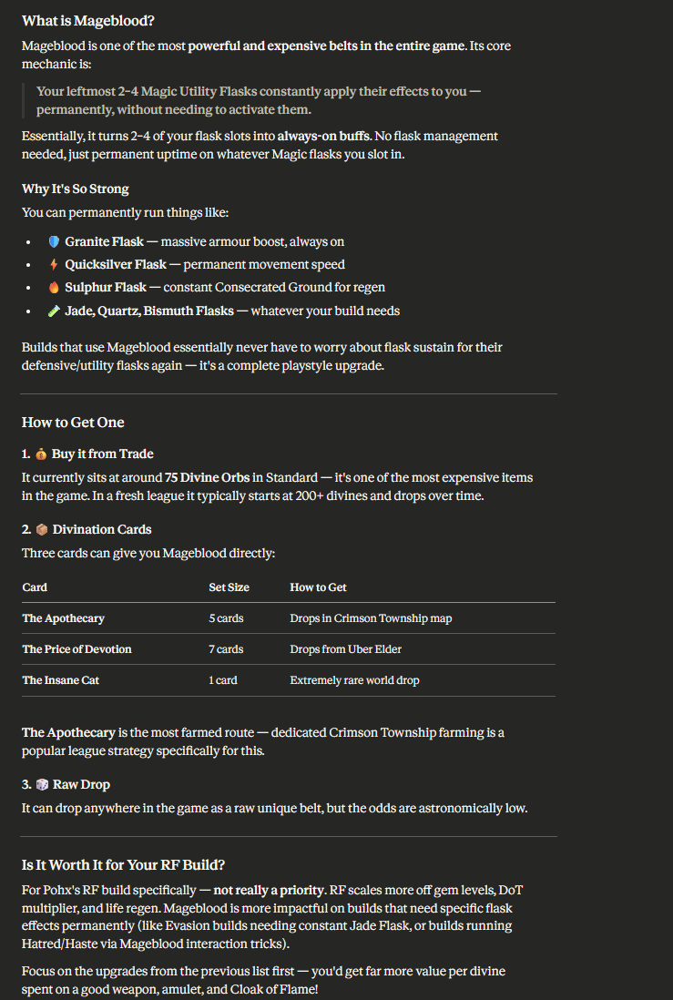

**Prompt:**

> I want to use Aegis Aurora. How much armour do I need to make it worthwhile?

<!-- screenshot: claude explaining the block recovery formula with armour thresholds -->

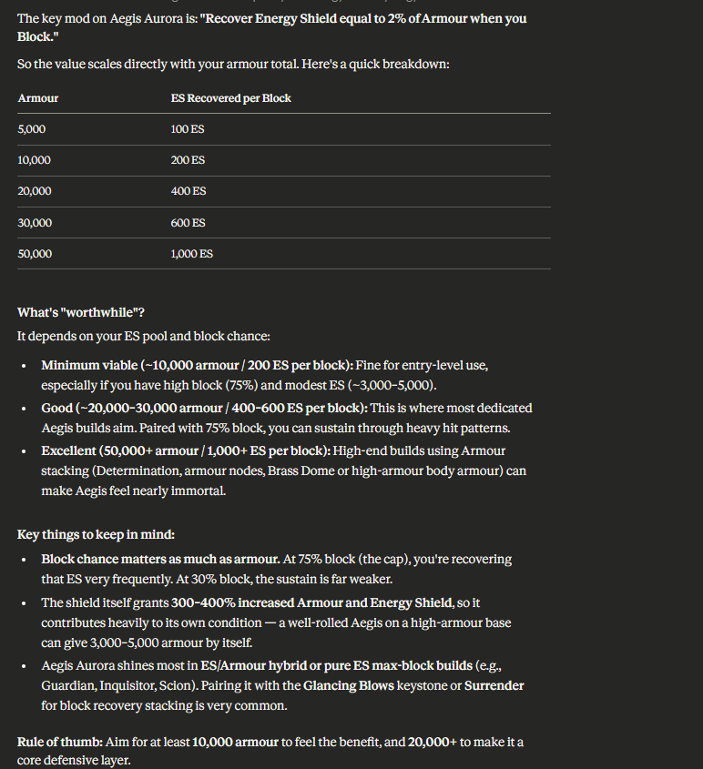

---

### Looking up what mods can roll on an item

Find every prefix and suffix available on a specific item type, filtered by stat if needed.

**Prompt:**

> What life prefixes can roll on a strength helmet, and what item level do I need?

<!-- screenshot: claude listing all life prefix tiers with iLvl requirements -->

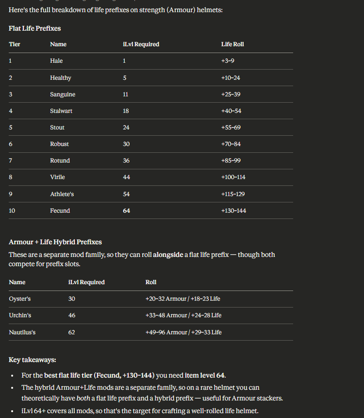

**Prompt:**

> What attack speed suffixes are available on dexterity gloves?

<!-- screenshot: claude listing attack speed suffix tiers -->

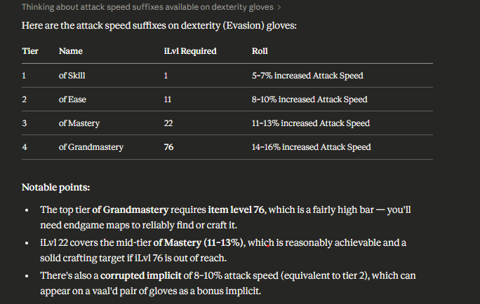

---

### Understanding a gem or support mechanic

Ask how any gem works, what it scales with, and what its level progression looks like.

**Prompt:**

> How does Trinity Support work? What is resonance and how do I maintain it?

<!-- screenshot: claude explaining resonance mechanic with the three-element condition -->

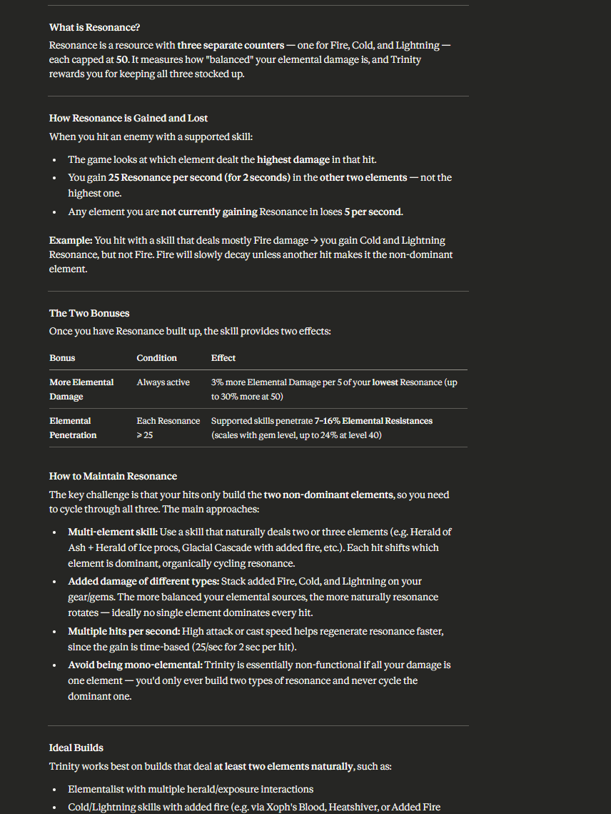

**Prompt:**

> What does Enlighten Support actually do and why is level 4 so rare?

<!-- screenshot: claude explaining xp requirements and cost multiplier reduction -->

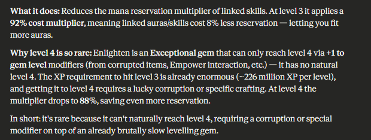

---

### Understanding a keystone or passive

Ask how any keystone or notable works, including the trade-offs.

**Prompt:**

> How does Eldritch Battery work with Mind Over Matter? Is it worth combining them?

<!-- screenshot: claude explaining the ES-to-mana interaction -->

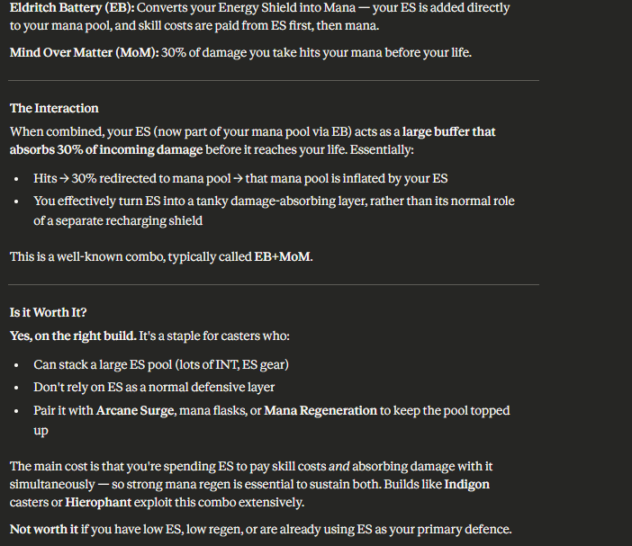

**Prompt:**

> What is Resolute Technique and why do so many builds use it?

<!-- screenshot: claude explaining the no-miss / no-crit trade-off -->

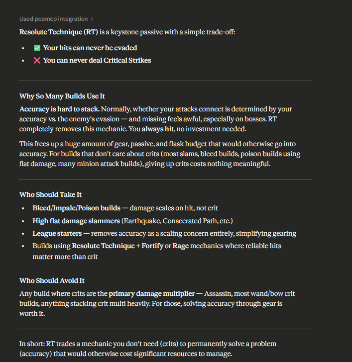

---

### Checking live prices

Get current prices directly from poe.ninja without leaving Claude.

**Prompt:**

> How much is Headhunter worth right now?

<!-- screenshot: claude returning headhunter price in chaos and divine orbs -->

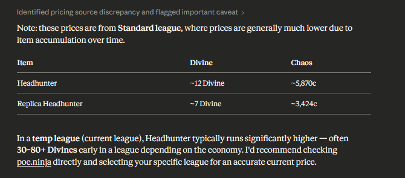

**Prompt:**

> What are the top currency exchange rates in the current league?

<!-- screenshot: claude showing top 20 currency rates from poe.ninja -->

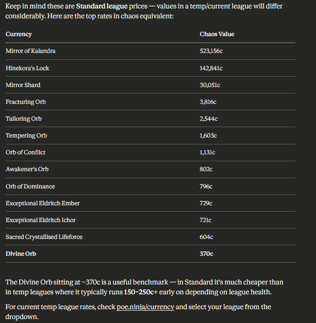

---

### Looking up a map

Find a map's boss, connected maps, and area info.

**Prompt:**

> What maps connect to Strand Map? I want to sustain it on the atlas.

<!-- screenshot: claude showing strand map connections and boss -->

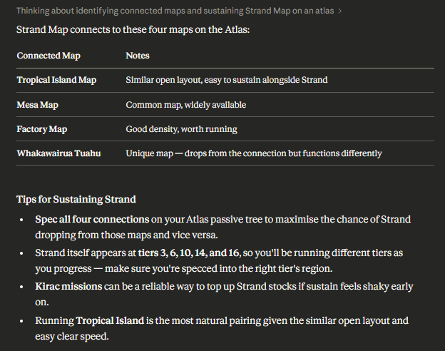

**Prompt:**

> What scarabs add breaches to my map and how many do they add?

<!-- screenshot: claude listing all breach scarab variants with effects -->

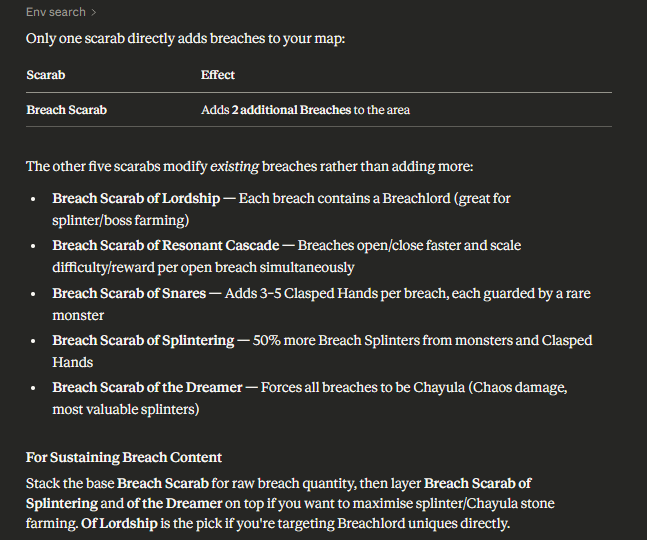
